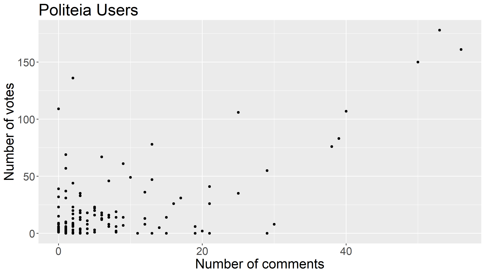

**Treasury balance: 627,194 DCR (approx +14,984 DCR/month) - $16.7 million (+$400k/month) based on $26.70 DCR price**

### New proposals

**[Decred Fundamental Metrics Research Proposal - Phase 1](https://proposals.decred.org/proposals/78b50f218106f5de40f9bd7f604b048da168f2afbec32c8662722b70d62e4d36)**
Published Jul 18 by \_checkmate\_ last updated Jul 19 - voting started on Jul 30 - 18 comments (+18)

Latest voting figures: 1,810 Yes votes, 196 No votes (90.2% Yes) - voter participation of 4.9%, support from 4% of tickets.

This proposal requests $12,000 for 3 months of research and social media campaign presence, plus an additional $2,000 for work already completed on a [Monetary Premiums article](https://medium.com/@_Checkmatey_/monetary-premiums-can-altcoins-compete-with-bitcoin-54c97a92c6d4). This research would involve developing a series of articles on key Decred fundamentals and mechanisms of Security, Scarcity and SoV properties, collecting and presenting data to support these articles and contributing to community education, engagement and social media presence. Example topics for this phase include tickets as a scarce asset, further analysis into Decred's scarcity mechanisms, quantifying ticket lockup as Decred's sleeper halving, and on-chain analysis fractals.

Comments on the proposal are all supportive, and express appreciation for @Checkmate's monetary premiums article. Some commenters question the $2,000 payment in arrears for work already completed, while others see this as being in line with the Decred philosophy of "show up, do some work, get paid if it's valuable to the project".

**[TinyDecred: A Python Toolkit for Decred](https://proposals.decred.org/proposals/20e967dad9e7398901decf3cfe0acf4e0853f6558a62607265c63fe791b8b124)**
Published Jul 30 by buck54321 last updated Jul 30 - 7 comments (+7)

This proposal requests $8,000 for work already completed on [TinyDecred](https://github.com/buck54321/tinydecred), a set of Python tools which enable Python developers to easily add support for Decred into their applications. @buck54321 has been a Decred contributor and contractor for a year working mostly on dcrdata, they developed TinyDecred as an unpaid learning exercise initially, but now think it has reached a point where it has value for the community, and request $8,000 for the work which went into it. Costs are predicated on more than 2 months of full-time work, at a substantial reduction to @buck54321's usual contractor hourly rate. If the proposal is approved, the TinyDecred repository will be moved to the Decred organization, and @buck54321 will continue to maintain it.

@chappjc (dcrdata maintainer) has the top comment, vouching for the quality of @buck54321's work and the utility of the TinyDecred tools. Other comments are also supportive of the proposal, @checkmate and @s_ben both state that the tools will be useful to them directly, and there is a general sense that they will make Decred more accessible to a broader range of developers.

### Abandoned proposals

**[Supplemental Proposal For Decred Tutorials By Denni Lovejoy](https://proposals.decred.org/proposals/d8d7ff7ad138ed322422aaa4d2a3e1c61f296ae56a2c2316cc5ecd10cf8dd8bd)**

There were no further comments and the proposal was abandoned as requested by @dennilovejoy.

### Approved proposals

**[Decred Bug Bounty Proposal: Phase 2](https://proposals.decred.org/proposals/073694ed82d34b2bfff51e35220e8052ad4060899b23bc25791a9383375cae70) - voting finished Jul  1 - 15 comments (+0)**
12,020 Yes votes, 830 No votes (93.5% Yes) - voter participation of 31.5%, support from 29% of tickets.

@degeri has since posted another [status update](https://twitter.com/degeri_crypto/status/1154776087374770176) for the Bounty program on July 26, it is up to 67 submissions, 9 being eligible for a payout, details at [bounty.decred.org](https://bounty.decred.org/).

### Other news

The [DEX specification](https://github.com/decred/dcrdex/) (as approved in [this proposal](https://proposals.decred.org/proposals/a4f2a91c8589b2e5a955798d6c0f4f77f2eec13b62063c5f4102c21913dcaf32)) was [released](https://twitter.com/decredproject/status/1156652694502817793?s=20) on July 31. This marks a significant step towards the realization of free decentralized exchange infrastructure with no intermediary tokens, gatekeepers or rent-seekers. The specification lays out in detail a plan which can be followed to produce DEX infrastructure with the desired properties. 

Politeia development work this month has focused on the redesign of the frontend and the integration of tlog (of Google's open source [Trillian](https://github.com/google/trillian) data store) on the backend as a replacement for git. tlog will facilitate scaling, allow for timestamping of individual records (as opposed to journals), and allow the filesystem to be swapped for something like IPFS. Associated [issue](https://github.com/decred/politeia/issues/947).

As part of the [Pi Research project](https://github.com/RichardRed0x/pi-research), the code to process Pi data has been iterated to look up user IDs and names (making use of the new API endpoint), and data can now be presented on the basis of usernames. This [table](https://github.com/RichardRed0x/pi-research/blob/master/data/comments-and-updown-votes/pi-users.csv) and [short report](https://github.com/RichardRed0x/pi-research/blob/master/analysis/comments-and-updown-votes/users-review.md) were released, giving an overview of the data and some basic plots.

 

This scatterplot shows a relationship between voting and commenting activity, but there are also users who are mostly active in just one of those ways. 32% of Pi users only commented (17%) or voted (15%), and did not do the other action at all.

- From Jun 30 until Jul 31 there were:
  * 2 new proposals submitted, 1 proposal started voting, 1 proposal finished voting.
  * 30 comments on Politeia proposals from 18 different users.
  *  75  up/down votes on comments from  18  different voting users.

## About this issue

Snapshot for this issue based on this [commit](https://github.com/decred-proposals/mainnet/commit/9d932f5f016a34a2c256555cedb364518319c7a4).

Content for this edition was authored by @richardred, Politeia dev update courtesy of @lukebp.

Also available on [medium](https://medium.com/@richardred/issue-19-june-30-july-31-2019-c591fcb79d98).

